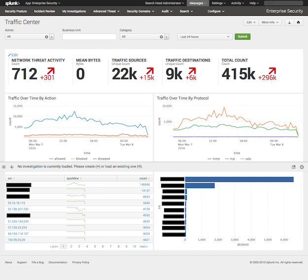
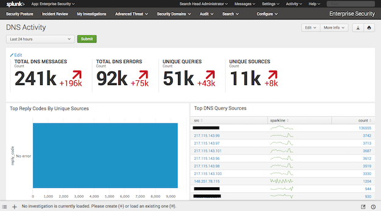
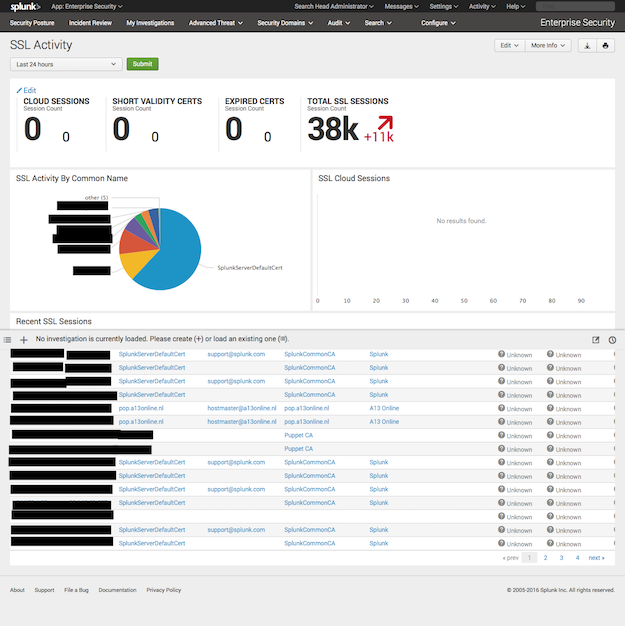

# TA-bro-ids for Splunk

This CIM compliant TA can be used with Splunk Enterprise Security and provides
field extractions, aliases and tags for the following Bro IDS log outputs:

* conn.log
* dns.log
* ssl.log
* x509.log

This fills the following panels in Splunk Enteprise Security:

* Traffic Center
* DNS Activity
* SSL Activity







## Installation

Install this TA on your Splunk (Enterprise Security) search head. Make sure to
rename it TA-bro-ids otherwise ES won't eat it. Though not strictly necessary,
you can also install this TA on your Splunk indexers to make sure timestamp
extraction is as efficient as possible, and no line merging will take place.

Install and configure Bro IDS, together with Splunk Universal Forwarder.

## Configuration

Have the Bro log files indexed by a Splunk Universal Forwarder. For example
with the following inputs.conf:

```
[monitor:///opt/bro/spool/bro/conn.log]
disabled = 0
sourcetype = bro_conn
index=bro

[monitor:///opt/bro/spool/bro/dns.log]
disabled = 0
sourcetype = bro_dns
index=bro

[monitor:///opt/bro/spool/bro/ssl.log]
disabled = 0
sourcetype = bro_ssl
index=bro

[monitor:///opt/bro/spool/bro/x509.log]
disabled = 0
sourcetype = bro_x509
index=bro
```

## Field extractions

All field extractions take place at search time, and should work fine.  If for
whatever reason you need to update these, this string of bash commands may come
in handy to update the field extractions from the field headers in the log files:

```
head conn.log |grep ^#fields |sed 's/#fields\t//g' |sed 's/\./_/g' |sed 's/\t/>[^\\t]+)\\t(\?</g' |awk '{print $1">[^\\t]+)"}' |sed 's/^ts>\[^\\t\]+)/^[0-9.]+/g'
```
